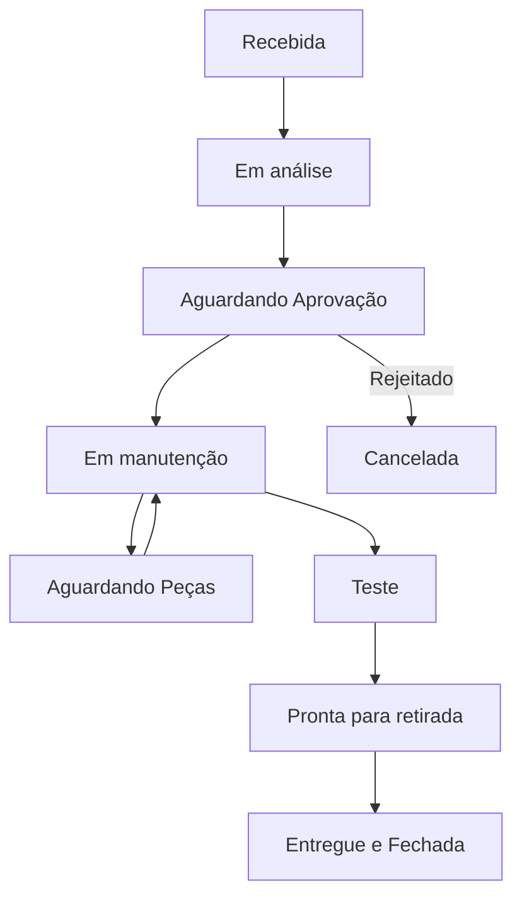

# PRD — ERP West Máquinas
*Documentação Completa de Requisitos do Sistema*

---

## Índice
- [Documento 0 — Visão do Produto](#documento-0--visão-do-produto)
- [Documento 1 — Arquitetura do Sistema](#documento-1--arquitetura-do-sistema)
- [Documento 2 — Modelagem do Banco de Dados](#documento-2--modelagem-do-banco-de-dados)
- [Documento 3 — Sistema de Login, Autenticação e Permissões](#documento-3--sistema-de-login-autenticação-e-permissões)
- [Documento 4 — Dashboard do Administrador](#documento-4--dashboard-do-administrador)
- [Documento 5 — Central de Atendimento da Vendedora](#documento-5--central-de-atendimento-da-vendedora)
- [Documento 6 — Vitrine Digital (Catálogo Público)](#documento-6--vitrine-digital-catálogo-público)
- [Documento 7 — Gestão de Produtos e Estoque](#documento-7--gestão-de-produtos-e-estoque)
- [Documento 8 — Caixa e Financeiro](#documento-8--caixa-e-financeiro)
- [Documento 9 — Ordens de Serviço (Assistência Técnica)](#documento-9--ordens-de-serviço-assistência-técnica)
- [Documento 10 — Gestão de Clientes e Garantias](#documento-10--gestão-de-clientes-e-garantias)
- [Documento 11 — Relatórios, Indicadores e Business Intelligence (BI)](#documento-11--relatórios-indicadores-e-business-intelligence-bi)
- [Documento 12 — Configurações Gerais, Notificações e Parametrizações](#documento-12--configurações-gerais-notificações-e-parametrizações)

---

## Documento 0 — Visão do Produto

**Versão:** 1.0  
**Status:** Em elaboração  

### 1. Introdução
O **ERP West Máquinas** é um sistema web desenvolvido exclusivamente para atender às necessidades da **West Máquinas**, uma empresa especializada na venda de máquinas de costura industriais, máquinas domésticas, peças, acessórios, produtos de armarinho e serviços de manutenção.

O sistema tem como objetivo substituir controles manuais por uma plataforma única, organizada, segura e intuitiva, permitindo que todas as operações da empresa sejam realizadas em um só lugar.

O projeto foi pensado para acompanhar o crescimento da empresa, permitindo que novos módulos sejam adicionados futuramente sem comprometer a estrutura existente.

### 2. Missão do Sistema
Centralizar toda a operação da West Máquinas em um único sistema, oferecendo:
* Controle de estoque.
* Gestão de vendas.
* Controle financeiro.
* Gerenciamento de ordens de serviço.
* Cadastro de clientes.
* Controle de garantias.
* Catálogo digital para clientes (Vitrine Digital).
* Relatórios e indicadores para tomada de decisão.

### 3. Objetivos do Projeto
Os principais objetivos são:
* Eliminar planilhas e controles manuais.
* Facilitar o trabalho da vendedora.
* Permitir ao administrador acompanhar a empresa em tempo real.
* Disponibilizar um catálogo digital para os clientes.
* Organizar todas as informações da empresa em um único banco de dados.
* Diminuir erros operacionais.
* Facilitar o crescimento da empresa.

### 4. Escopo da Versão 1.0
A primeira versão do sistema contemplará os seguintes módulos:

#### Autenticação
* Login seguro.
* Controle de permissões por perfil.

#### Dashboard Administrativo
* Resumo financeiro.
* Indicadores de vendas.
* Produtos em falta.
* Produtos com baixa saída.
* Garantias próximas do vencimento.
* Alertas do sistema.

#### Dashboard / Central de Atendimento da Vendedora
* Abertura de caixa.
* Fechamento de caixa.
* Registro de vendas.
* Cadastro de clientes.
* Cadastro de produtos.
* Consulta rápida ao estoque.
* Abertura de ordens de serviço.

#### Produtos
* Cadastro de máquinas, peças e produtos de armarinho.
* Cadastro de categorias e subcategorias.
* Cadastro de promoções.

#### Estoque
* Controle de entradas e saídas.
* Quantidade disponível.
* Histórico de movimentações.
* Alerta de estoque mínimo.

#### Caixa
* Abertura e fechamento diários.
* Registro de vendas, entradas e saídas manuais.
* Conferência do saldo.

#### Clientes
* Cadastro completo.
* Histórico de compras e ordens de serviço.
* Garantias ativas.

#### Ordens de Serviço
* Cadastro da máquina, defeito informado, serviço executado, peças utilizadas, valor, garantia e controle de status.

#### Catálogo Público (Vitrine Digital)
* Lista de produtos, promoções, banner personalizado, pesquisa, filtros e botão "Comprar pelo WhatsApp".

#### Relatórios
* Relatório diário, semanal, mensal e impressão pelo navegador.

### 5. Funcionalidades Fora do Escopo da Versão 1.0
* Emissão de nota fiscal.
* Integração com marketplaces (Mercado Livre, Shopee).
* Aplicativo nativo para Android e iOS.
* Leitor de código de barras físico.
* Impressão de etiquetas.
* Integração com WhatsApp Business API (usar links de redirecionamento simples).
* Integração com Pix automático (gateway).
* Controle avançado de contas a pagar.
* Múltiplas filiais.

### 6. Perfis de Usuário
* **Administrador:** Acesso total ao sistema (gerenciar usuários, configurações, relatórios, alteração de preços, cadastros, banners, etc.).
* **Vendedora:** Acesso operacional (caixa, registrar vendas, cadastrar clientes, abrir OS, consultar estoque, cadastrar produtos, alterar quantidades). Não acessa configurações nem gerencia usuários.
* **Cliente:** Não possui login. Apenas acessa a Vitrine Digital pública, pesquisa produtos, filtra e inicia contato via WhatsApp.

---

## Documento 1 — Arquitetura do Sistema

**Versão:** 1.0  

### 1. Objetivo da Arquitetura
A arquitetura do ERP West Máquinas prioriza:
* Organização e facilidade de manutenção.
* Escalabilidade e alto desempenho.
* Interface intuitiva e responsiva (computador, tablet e celular).
* Segurança de dados.

### 2. Tecnologias Definidas
* **Front-end:**
  * Next.js 15
  * React
  * TypeScript
  * Tailwind CSS
  * shadcn/ui
  * Lucide React (ícones)
  * React Hook Form
  * Zod (validação)
* **Back-end & Banco de Dados:**
  * Supabase (PostgreSQL)
  * Supabase Auth
  * Supabase Storage
  * Row Level Security (RLS) para proteção de dados
* **Hospedagem:**
  * GitHub (repositório)
  * Vercel (deploy front-end)

---

## Documento 2 — Modelagem do Banco de Dados

**Versão:** 1.0  

### 1. Objetivo
O banco de dados será hospedado no Supabase (PostgreSQL), normalizado, seguro e preparado para expansões.

### 2. Tabelas e Campos principais

#### Tabela: `usuarios` (Gerenciado via Supabase Auth + tabela pública de perfis)
* `id` (PK, uuid)
* `nome` (text)
* `email` (text, unique)
* `perfil` ('Administrador' | 'Vendedora')
* `ativo` (boolean, default true)
* `criado_em` (timestamp)
* `atualizado_em` (timestamp)
* `ultimo_login` (timestamp)

#### Tabela: `clientes`
* `id` (PK, uuid)
* `nome` (text)
* `telefone` (text)
* `whatsapp` (text)
* `cpf` (text, opcional, único)
* `endereco` (text)
* `bairro` (text)
* `cidade` (text)
* `cep` (text)
* `observacoes` (text)
* `criado_em` (timestamp)
* `atualizado_em` (timestamp)

#### Tabela: `categorias`
* `id` (PK, uuid)
* `nome` (text)  *(Ex: Máquinas, Peças, Armarinho)*
* `categoria_pai_id` (FK, uuid, self-referencing, opcional para subcategorias)

#### Tabela: `produtos`
* `id` (PK, uuid)
* `nome` (text)
* `descricao` (text)
* `categoria_id` (FK `categorias`)
* `subcategoria` (text, opcional)
* `marca` (text)
* `modelo` (text)
* `preco_custo` (numeric)
* `preco_venda` (numeric)
* `parcelamento` (text, opcional)
* `quantidade` (integer, estoque atual)
* `estoque_minimo` (integer)
* `ativo` (boolean, default true)
* `em_promocao` (boolean, default false)
* `destaque` (boolean, default false)
* `criado_em` (timestamp)
* `atualizado_em` (timestamp)

#### Tabela: `fotos_produtos`
* `id` (PK, uuid)
* `produto_id` (FK `produtos` ON DELETE CASCADE)
* `url` (text)
* `ordem` (integer)
* `principal` (boolean)

#### Tabela: `compatibilidade_pecas`
* `id` (PK, uuid)
* `produto_id` (FK `produtos` - peça)
* `categoria_da_maquina` (text) *(Ex: Reta, Overlock, etc.)*
* `modelo_da_maquina` (text, opcional)

#### Tabela: `fornecedores`
* `id` (PK, uuid)
* `nome` (text)
* `telefone` (text)
* `whatsapp` (text)
* `email` (text)
* `cidade` (text)
* `observacoes` (text)

#### Tabela: `compras`
* `id` (PK, uuid)
* `fornecedor_id` (FK `fornecedores`)
* `data` (timestamp)
* `valor_total` (numeric)
* `observacoes` (text)

#### Tabela: `itens_compra`
* `id` (PK, uuid)
* `compra_id` (FK `compras` ON DELETE CASCADE)
* `produto_id` (FK `produtos`)
* `quantidade` (integer)
* `preco_unitario` (numeric)

#### Tabela: `movimentacao_estoque`
* `id` (PK, uuid)
* `produto_id` (FK `produtos`)
* `tipo` ('Entrada' | 'Venda' | 'Ajuste Manual' | 'Ordem de Serviço' | 'Perda' | 'Devolução')
* `quantidade` (integer)
* `usuario_id` (FK `usuarios`)
* `data` (timestamp)
* `observacao` (text)

#### Tabela: `vendas`
* `id` (PK, uuid)
* `cliente_id` (FK `clientes`, opcional para "Cliente Balcão")
* `vendedor_id` (FK `usuarios`)
* `data` (timestamp)
* `subtotal` (numeric)
* `desconto` (numeric)
* `total` (numeric)
* `forma_pagamento` ('Dinheiro' | 'Pix' | 'Cartão de Débito' | 'Cartão de Crédito' | 'Transferência')
* `status` ('Finalizada' | 'Cancelada')

#### Tabela: `itens_venda`
* `id` (PK, uuid)
* `venda_id` (FK `vendas` ON DELETE CASCADE)
* `produto_id` (FK `produtos`)
* `quantidade` (integer)
* `preco_unitario` (numeric)
* `desconto` (numeric)

#### Tabela: `caixa`
* `id` (PK, uuid)
* `data` (date)
* `usuario_abertura_id` (FK `usuarios`)
* `valor_abertura` (numeric)
* `valor_fechamento` (numeric, opcional)
* `valor_conferido` (numeric, opcional)
* `diferenca` (numeric, opcional)
* `status` ('Aberto' | 'Fechado')
* `criado_em` (timestamp)
* `fechado_em` (timestamp, opcional)

#### Tabela: `movimentacoes_caixa` (Entradas e Saídas Manuais)
* `id` (PK, uuid)
* `caixa_id` (FK `caixa`)
* `tipo` ('Entrada' | 'Saída')
* `valor` (numeric)
* `motivo` (text)
* `responsavel_id` (FK `usuarios`)
* `data` (timestamp)
* `observacao` (text)

#### Tabela: `ordens_servico`
* `id` (PK, uuid)
* `numero` (serial, incremental automático)
* `cliente_id` (FK `clientes`)
* `marca_maquina` (text)
* `modelo_maquina` (text)
* `numero_serie` (text, opcional)
* `cor_maquina` (text, opcional)
* `estado_geral` (text)
* `acessorios_entregues` (text)
* `defeito_informado` (text)
* `diagnostico` (text, opcional)
* `servico_executado` (text, opcional)
* `valor_mao_obra` (numeric, default 0)
* `valor_pecas` (numeric, default 0)
* `valor_total` (numeric, default 0)
* `status` ('Recebida' | 'Em análise' | 'Aguardando aprovação' | 'Aguardando peças' | 'Em manutenção' | 'Teste' | 'Pronta para retirada' | 'Entregue' | 'Cancelada')
* `data_entrada` (timestamp)
* `previsao_entrega` (timestamp, opcional)
* `data_entrega` (timestamp, opcional)
* `garantia_dias` (integer, default 30)

#### Tabela: `itens_os` (Peças utilizadas na OS)
* `id` (PK, uuid)
* `os_id` (FK `ordens_servico` ON DELETE CASCADE)
* `produto_id` (FK `produtos`)
* `quantidade` (integer)
* `preco_unitario` (numeric)

#### Tabela: `garantias`
* `id` (PK, uuid)
* `cliente_id` (FK `clientes`)
* `origem` ('Venda' | 'Ordem de Serviço')
* `origem_id` (uuid, referência para a venda ou OS correspondente)
* `tipo` ('Máquina' | 'Serviço')
* `data_inicio` (date)
* `data_fim` (date)
* `status` ('Ativa' | 'Vencida')

#### Tabela: `promocoes`
* `id` (PK, uuid)
* `titulo` (text)
* `descricao` (text)
* `imagem_url` (text, opcional)
* `data_inicio` (timestamp)
* `data_fim` (timestamp)
* `ativa` (boolean, default true)

#### Tabela: `banners`
* `id` (PK, uuid)
* `titulo` (text)
* `subtitulo` (text)
* `imagem_url` (text)
* `texto_botao` (text)
* `link` (text)
* `ativo` (boolean, default true)
* `ordem` (integer)

#### Tabela: `notificacoes`
* `id` (PK, uuid)
* `usuario_id` (FK `usuarios`, opcional se for geral)
* `titulo` (text)
* `mensagem` (text)
* `lida` (boolean, default false)
* `criada_em` (timestamp)

#### Tabela: `configuracoes`
* `id` (PK, uuid, registro único)
* `nome_loja` (text)
* `telefone` (text)
* `whatsapp` (text)
* `email` (text)
* `endereco` (text)
* `instagram` (text)
* `facebook` (text)
* `logo_url` (text)
* `prazo_garantia_maquina_dias` (integer, default 90)
* `prazo_garantia_servico_dias` (integer, default 30)
* `estoque_minimo_padrao` (integer, default 5)

#### Tabela: `logs_sistema` (Auditoria)
* `id` (PK, uuid)
* `usuario_id` (FK `usuarios`, opcional)
* `acao` (text)
* `detalhes` (text)
* `ip` (text, opcional)
* `data_hora` (timestamp)

#### Tabela: `historico_precos`
* `id` (PK, uuid)
* `produto_id` (FK `produtos` ON DELETE CASCADE)
* `preco_custo_antigo` (numeric)
* `preco_custo_novo` (numeric)
* `preco_venda_antigo` (numeric)
* `preco_venda_novo` (numeric)
* `usuario_id` (FK `usuarios`)
* `data_alteracao` (timestamp)

---

## Documento 3 — Sistema de Login, Autenticação e Permissões

### 1. Objetivo
Garantir o acesso controlado e seguro, utilizando o Supabase Auth com gerenciamento de permissões através do modelo **RBAC (Role-Based Access Control)** para facilitar futura adição de perfis.

### 2. Perfis Iniciais (Versão 1.0)
* **Administrador:** Acesso total de leitura e escrita a todas as tabelas, relatórios, configurações e logs.
* **Vendedora:** Acesso operacional de leitura/escrita focado nas vendas cotidianas, ordens de serviço, clientes e consulta de estoque.
  * *Não pode:* Excluir vendas, excluir clientes, excluir OS, excluir produtos, alterar configurações gerais, gerenciar usuários, visualizar logs.

### 3. Matriz de Permissões
| Funcionalidade | Administrador | Vendedora |
| :--- | :---: | :---: |
| Login | ✅ | ✅ |
| Visualizar Dashboard | ✅ | ✅ |
| Registrar Venda | ✅ | ✅ |
| Cancelar/Excluir Venda | ✅ | ❌ |
| Abrir / Fechar Caixa | ✅ | ✅ |
| Cadastrar / Editar Produto | ✅ | ✅ |
| Excluir Produto | ✅ | ❌ |
| Ajustar Estoque Manualmente | ✅ | ✅ |
| Excluir Histórico/Movimentação | ✅ | ❌ |
| Cadastrar / Editar Cliente | ✅ | ✅ |
| Excluir Cliente | ✅ | ❌ |
| Abrir / Editar OS | ✅ | ✅ |
| Finalizar OS | ✅ | ✅ |
| Excluir OS | ✅ | ❌ |
| Alterar Preços de Produtos | ✅ | ✅ *(opção de limitar apenas ao admin pode ser configurada)* |
| Criar Promoções | ✅ | ✅ |
| Alterar Banners da Vitrine | ✅ | ✅ |
| Gerenciar Usuários do Sistema | ✅ | ❌ |
| Alterar Configurações Gerais | ✅ | ❌ |
| Visualizar Logs e Auditoria | ✅ | ❌ |

---

## Documento 4 — Dashboard do Administrador

Painel executivo focado em dar clareza imediata sobre a saúde financeira e operacional da West Máquinas em menos de 30 segundos.

### 1. Barra Superior (Header) & Busca Global
* Logotipo e link rápido para a Vitrine Digital.
* **Busca Global em tempo real:** Campo que pesquisa instantaneamente por Clientes, Produtos, Máquinas, Peças, OS e Vendas, exibindo sugestões suspensas à medida que digita.
* **Central de Notificações (Sino):** Exibe avisos críticos de estoque baixo, garantias vencendo e OS atrasadas. Permite marcar como lida ou ignorar.
* **Perfil do Usuário:** Foto, nome, cargo e menu de navegação (Meu Perfil, Configurações, Sair).

### 2. Cards Indicadores Principais (com comparação de períodos)
1. **Vendas Hoje:** Valor total (Ex: R$ 2.350,00) e percentual de comparação com o dia anterior (Ex: ⬆ +18% ou ⬇ -5%).
2. **Vendas da Semana:** Valor total e comparação com a semana anterior.
3. **Vendas do Mês:** Valor acumulado, meta configurada e percentual atingido.
4. **Ticket Médio:** Valor médio gasto por venda.
5. **Lucro Estimado:** Faturamento menos preço de custo dos produtos vendidos.
6. **Status do Caixa:** Indicador visual (🔴 Fechado / 🟢 Aberto) e saldo em caixa.

### 3. Gráficos Interativos (Line, Bar, Pie)
* **Gráfico Financeiro (Linhas):** Evolução da Receita e Lucro em períodos filtráveis (Hoje, 7 dias, 30 dias, 12 meses).
* **Distribuição Financeira:** Vendas por forma de pagamento e faturamento por categoria de produto.

### 4. Widgets e Tabelas
* **Produtos mais vendidos:** Tabela com Produto, Categoria, Qtd. Vendida, Faturamento, Lucro e botão "Visualizar".
* **Produtos com baixa saída:** Identifica produtos parados há 30, 60 ou 90 dias com sugestão de "Criar promoção".
* **Alertas Inteligentes:** Avisos dinâmicos como "Existem 5 produtos abaixo do estoque mínimo", "A garantia do cliente João vence amanhã", etc.
* **Atividades Recentes:** Linha do tempo cronológica das ações do sistema (Ex: "10:15 - Caixa aberto").

### 5. Ações Rápidas (Atalhos)
* Botões grandes para: Nova Venda, Nova OS, Novo Cliente, Novo Produto, Registrar Entrada/Saída de Caixa, Abrir/Fechar Caixa.

---

## Documento 5 — Central de Atendimento da Vendedora

A principal ferramenta de trabalho diário da vendedora, projetada para consolidar quase todas as suas funções em uma única página fluida, reduzindo cliques e tempo de atendimento.

### 1. Fluxo de Trabalho Integrado
1. Login ➔ 2. Abrir Caixa ➔ 3. Identificar/Pesquisar Cliente ➔ 4. Consultar Produto/Estoque ➔ 5. Iniciar Venda ou OS ➔ 6. Registrar Forma de Pagamento ➔ 7. Imprimir Comprovante.

### 2. Estrutura da Tela
A Central é dividida visualmente em seções acessíveis sem recarregar a página:
* **Resumo do Dia (Cards no Topo):** Status do caixa, valor total vendido hoje, número de OS abertas, clientes atendidos.
* **Ações Rápidas:** Acesso a formulários modais de "Nova Venda", "Nova OS", "Novo Cliente", "Entrada/Saída de Caixa".
* **Pesquisa Inteligente (Centro):** Busca instantânea por produtos, marcas, compatibilidades e clientes.
* **Atendimento em Andamento (Rascunho):** Permite salvar o estado de uma venda como rascunho para não travar o fluxo caso o cliente precise decidir algo.
* **Painel Lateral de Pendências:** Exibe lista de máquinas prontas para retirada, garantias próximas do vencimento e produtos abaixo do estoque mínimo.
* **Histórico Recente (Rodapé):** Últimas ações executadas pela vendedora logada no dia.

### 3. Registro de Vendas Simplificado
* Busca e inclusão de produtos direto na venda (com exibição de fotos e quantidade em estoque).
* Possibilidade de selecionar cliente ou usar a opção rápida **"Cliente Balcão"** (sem cadastro).
* Registro das formas de pagamento e cálculo automático de troco e descontos.

---

## Documento 6 — Vitrine Digital (Catálogo Público)

Área pública e otimizada para SEO, acessível por clientes sem necessidade de login. Foco estritamente comercial: **expor produtos e direcionar o fechamento da compra para o WhatsApp**.

### 1. Estrutura e Seções
* **Cabeçalho:** Logotipo, busca rápida, link direto para contato.
* **Banner Principal:** Carrossel totalmente dinâmico e configurável com promoções ativas (Ex: "Semana das Máquinas de Costura").
* **Categorias:** Filtros rápidos como Máquinas, Peças, Armarinho em formato de cards clicáveis.
* **Produtos em Promoção:** Seção destacada exibindo preço promocional e preço original riscado.
* **Grid de Todos os Produtos:** Exibição em cards com foto principal, marca, modelo, valor, condições de parcelamento e selo de disponibilidade.
* **Rodapé:** Endereço, horário de funcionamento, links de redes sociais e texto institucional editável.

### 2. Detalhes do Produto e Integração WhatsApp
* Ao clicar em "Ver Detalhes", abre-se uma página com galeria de fotos, descrição completa, especificações técnicas, compatibilidades (para peças) e produtos recomendados.
* **Botão "Solicitar pelo WhatsApp":** Redireciona o usuário para o WhatsApp da loja com uma mensagem pré-preenchida contendo os dados do produto:
  > *"Olá! Tenho interesse no seguinte produto: Máquina Reta Direct Drive Lanmax LM-9980D. Gostaria de saber se ela ainda está disponível."*

---

## Documento 7 — Gestão de Produtos e Estoque

### 1. Cadastro Unificado de Produtos
* **Campos Obrigatórios:** Nome, Categoria, Marca, Modelo, Preço de Custo, Preço de Venda, Quantidade Atual e Estoque Mínimo.
* **Campos Opcionais:** Subcategoria, Parcelamento Disponível, Destaque (exibir na Vitrine), Promoção ativa, Observações internas.
* **Fotos dos Produtos:** Múltiplas imagens por produto. Definição de foto principal, reordenação e exclusão.

### 2. Controle de Estoque Rigoroso
* **Entrada de Mercadorias:** Registro contendo produto, quantidade, preço de custo, fornecedor, data e observações. Atualiza automaticamente a quantidade em estoque e gera histórico de preços.
* **Movimentações de Estoque:** Tabela de auditoria não editável que registra todo fluxo (Entrada, Venda, OS, Ajuste Manual, Perda, Devolução) indicando data, quantidade e usuário.
* **Ajustes de Estoque:** Exclusivo para administradores, exige motivo e observação (Ex: Ajuste por quebra de peça).
* **Inventário:** Fluxo para conferência física periódica (selecionar produtos ➔ informar estoque real ➔ gerar divergências ➔ confirmar ajustes).

### 3. Histórico de Preços e Lista de Reposição
* **Histórico de Preços:** Gravação automática de preços antigos e novos com data e autor da alteração para análise de margens históricas.
* **Lista de Reposição:** Lista automatizada com produtos que atingiram ou estão abaixo do estoque mínimo, exibindo o último fornecedor e atalhos para marcar como "Pedido Realizado".

---

## Documento 8 — Caixa e Financeiro

### 1. Fluxo de Caixa Diário
* **Abertura de Caixa:** Exige que a vendedora informe o valor inicial em dinheiro no início do dia.
* **Registros de Entrada/Saída Manuais:** Permite lançar movimentações avulsas (Ex: Sangria para o administrador, compra de suprimentos da loja, troco). Exige valor, motivo e responsável.
* **Fechamento de Caixa:** No fim do dia, o sistema exibe o resumo financeiro calculado (vendas divididas por dinheiro, Pix, cartão, mais entradas e menos saídas). A vendedora informa o valor físico contado. O sistema calcula a diferença (sobra ou falta) e exige justificativa em caso de divergência.

### 2. Contas a Receber
* Controle simples de vendas a prazo ou manutenções faturadas.
* Campos: Cliente, Origem (Venda ou OS), Valor, Vencimento, Status (Pendente, Recebido, Atrasado).
* A quitação atualiza o status e gera automaticamente um lançamento de entrada no caixa ativo.

---

## Documento 9 — Ordens de Serviço (Assistência Técnica)

Modulo essencial projetado para mapear todo o ciclo de vida dos equipamentos trazidos para reparo.

### 1. Fluxo de Status da OS

### 2. Cadastro e Diagnóstico
* **Ficha de Entrada:** Cadastro do cliente, detalhes da máquina (Marca, Modelo, Nº de série, Cor), estado geral do equipamento (arranhões, partes quebradas), acessórios entregues (Ex: pedal, motor, mesa) e o defeito relatado.
* **Diagnóstico Técnico:** Registro do diagnóstico, serviço necessário, peças do estoque que serão utilizadas (com redução automática do estoque ao finalizar), valor da mão de obra e valor total.
* **Linha do Tempo (Timeline):** Histórico visual automático de todas as alterações na OS (Quem alterou o status, quando o orçamento foi aprovado, quando as peças foram anexadas, etc.).
* **Garantia de Manutenção:** Ao marcar como "Entregue", gera-se automaticamente uma garantia de serviço de 30 dias (ou prazo customizado).

---

## Documento 10 — Gestão de Clientes e Garantias

### 1. Perfil 360º do Cliente
Página unificada do cliente estruturada em abas:
* **Aba Resumo:** Painel inteligente exibindo tempo de cadastro, total financeiro gasto na loja, número de compras e manutenções efetuadas, garantias ativas e histórico do último atendimento.
* **Aba Compras:** Histórico de todas as vendas vinculadas.
* **Aba OS:** Lista de todas as ordens de serviço do cliente.
* **Aba Garantias:** Relação das garantias vigentes e expiradas.
* **Aba Contas a Receber:** Débitos pendentes do cliente.
* **Aba Observações:** Anotações internas específicas (Ex: "Prefere contato via WhatsApp").

### 2. Alertas de Garantias e Clientes Inativos
* Sistema verifica diariamente as datas finais de garantia e cria notificações automáticas nos prazos de 30, 15, 7 e 1 dia antes de vencer.
* **Identificação de Inativos:** Filtro automático que lista clientes que não realizam compras ou serviços há mais de 12 meses para ações de marketing.

---

## Documento 11 — Relatórios, Indicadores e BI

### 1. Relatórios Operacionais e Gerenciais
* **Financeiro:** Faturamento por período, fluxo de caixa detalhado, lucratividade líquida, faturamento por categoria de produto/serviço.
* **Vendas:** Desempenho por vendedor, produtos mais vendidos, descontos concedidos, cancelamentos.
* **Estoque:** Valor do estoque parado, movimentações, giro de estoque.
* **Assistência Técnica:** Quantidade de OS abertas/fechadas, tempo médio de reparo por técnico/modelo, peças mais utilizadas.

### 2. Rankings e Comparativos
* Comparativos rápidos exibidos em gráficos e tabelas:
  * Hoje vs. Ontem
  * Semana atual vs. Semana anterior
  * Mês atual vs. Mês anterior
  * Ano atual vs. Ano anterior
* Rankings automáticos de melhores clientes, produtos campeões de vendas e categorias mais lucrativas.

---

## Documento 12 — Configurações Gerais, Notificações e Parametrizações

### 1. Informações Institucionais e Impressão
* Cadastro de CNPJ, endereço, telefones, redes sociais, logotipo e termos de garantia.
* Configurações de cabeçalhos e rodapés para documentos gerados para impressão física/PDF (OS, comprovantes de caixa e relatórios).

### 2. Parametrizações Operacionais
* Definição dos prazos de garantia padrão (máquina e mão de obra).
* Configuração do estoque mínimo global padrão.
* Modelos de mensagens rápidas do WhatsApp para envio manual (Boas-vindas, Orçamento pronto, OS concluída, Agradecimento).

### 3. Painel de Saúde do Sistema (System Health)
Widget executivo com indicadores técnicos e operacionais:
* Espaço de armazenamento de imagens utilizado no Supabase Storage.
* Quantidade de produtos sem fotos cadastradas.
* Quantidade de produtos sem categoria vinculada.
* Data do último backup/exportação de dados.
* Versão atual do ERP.
